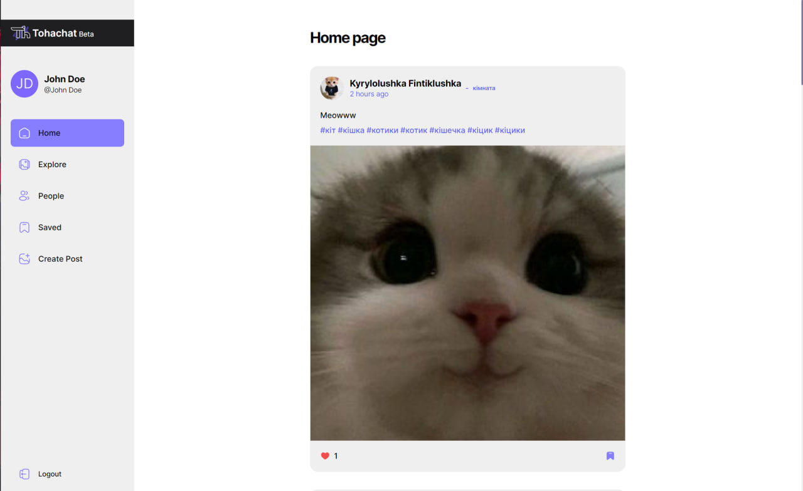
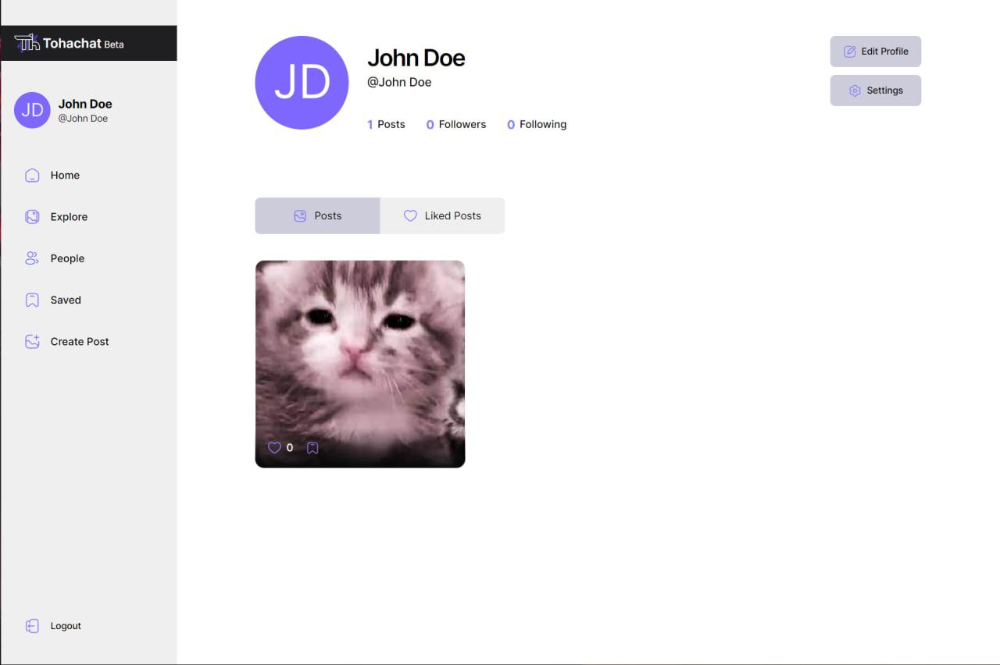

# Tohachat - React + Appwrite + TanStack Query

## In this review, I will show what Tohachat looks like.

But it is important to note the things with which this project was made
### In this project, I had to face big tasks such as:
- Authorization
- Management of api requests
- multiple pages
- active interaction with the database
- work with adaptive sites

### So, in this project, such technologies as
- React + Vite
- Appwrite
- TanStack Query
- TailwindCss
- TypeScript

## I am ready to show all the assets of this project:
### Registration/Authorization
</img>
### The main page where all publications are displayed
</img>
### Search page where you can find any publication by its title
</img>

### A page with people you may know
</img>
### Page with saved posts
</img>
### Page for creating a publication
</img>
### Profile page where there are both posts published by the user and liked posts
</img>
</img>
### There is a very simple settings page with only one option

Changing the theme takes place through LocalStorage, that is, while the session is active. And it will be saved even after reloading the page

</img>
</img>

### Adaptability

it is important to note that the entire page is fully responsive and available on devices of any screen size

</img>
</img>

